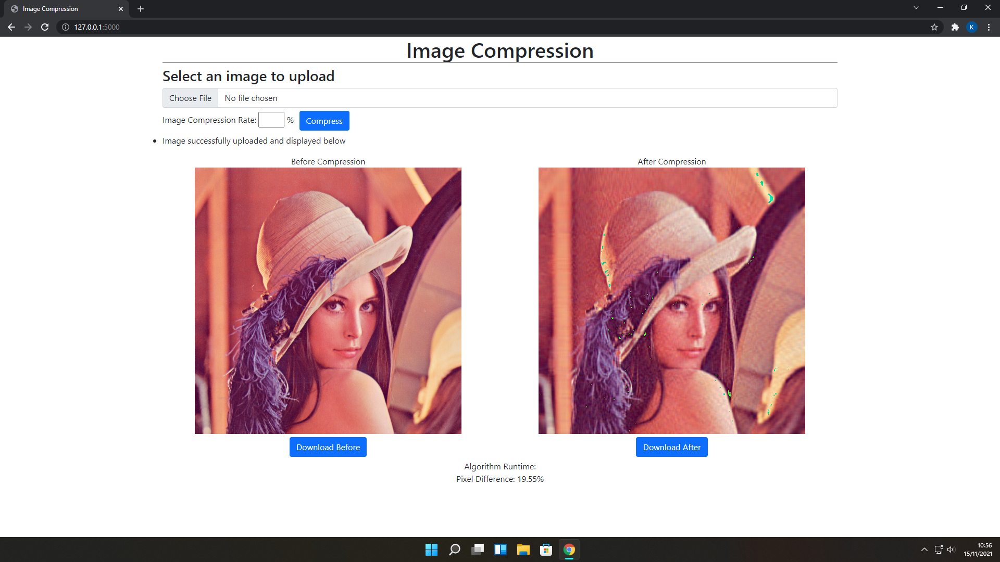

# SVD - Algeo02-20069
> Program SVD untuk Tubes 2 Algeo.

## Daftar Isi
- [SVD - Algeo02-20069](#svd---algeo02-20069)
  - [Daftar Isi](#daftar-isi)
  - [Tentang Program](#tentang-program)
  - [Tampilan Web](#tampilan-web)
  - [Buka Program](#buka-program)
  - [Dibuat Oleh](#dibuat-oleh)

## Tentang Program
Folder src terdiri dari folder static tempat gambar diupload, hasil compress dan file css. Folder templates terdiri dari file html. Selain itu merupakan file python untuk svd dan backend

## Tampilan Web

## Buka Program
    $ pip install flask
    $ cd src
    $ flask run

## Dibuat Oleh
- Kent Liusudarso 		13520069
- Muhammad Rakha Athaya	13520108
- Nicholas Budiono		13520121
